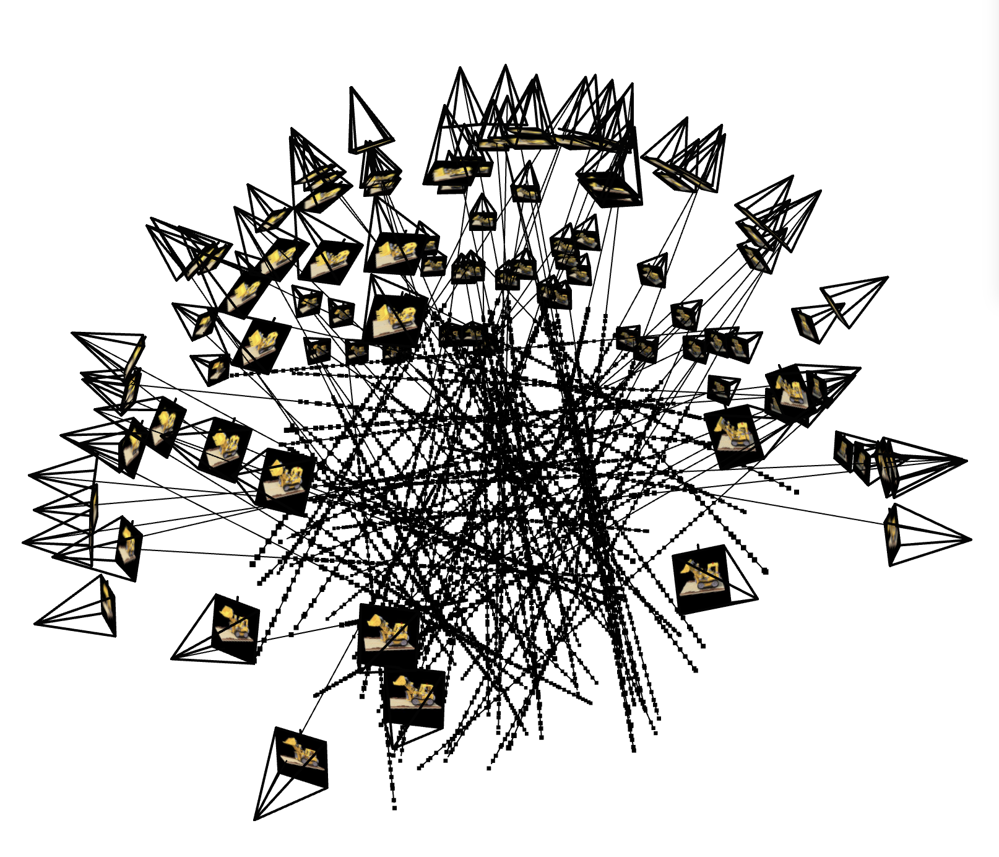
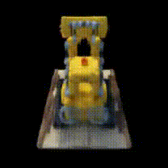
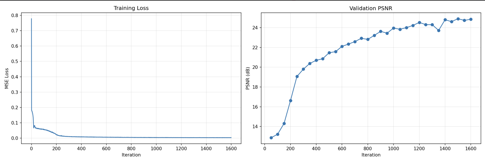
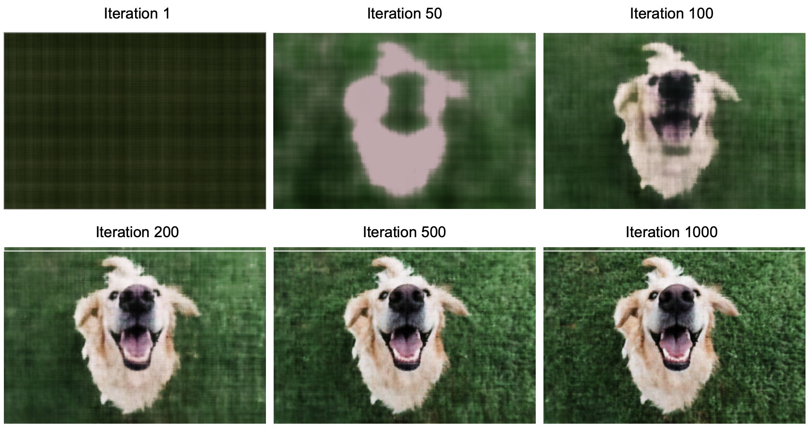
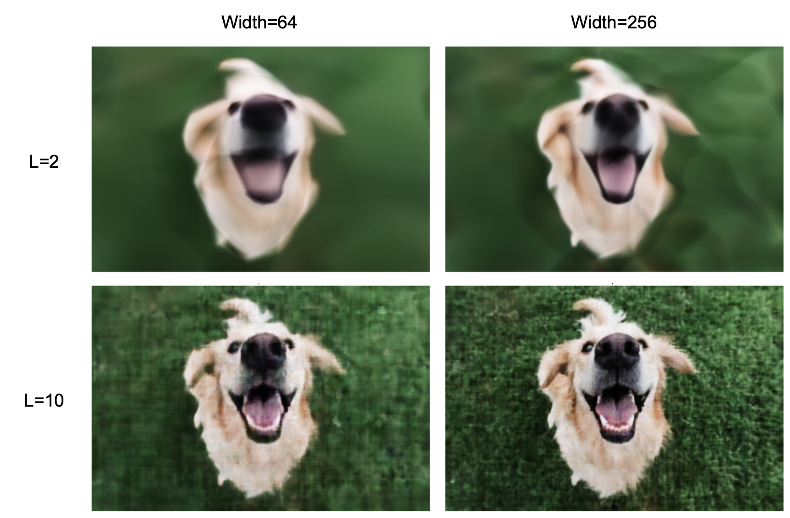

# Neural Radiance Fields from Scratch

End-to-end NeRF pipeline built from scratch in PyTorch with camera calibration with ArUco markers → pose estimation via PnP → neural scene representation → novel view synthesis



My blog article on what NeRF is and how training works:
https://khooanxian.medium.com/nerf-turning-photos-into-3d-6e5de0b6cb9e 

**TLDR**:
NeRF represents a scene as a continuous function learnt by a neural network. The function maps any given 3D coordinate and viewing direction to a color and density. With NeRF, you can take a handful of 2D photos of a scene and synthesise novel views from any angle with photorealistic lighting and reflections. This allows us to produce smooth videos as if a real 3D scene existed!

## Results

### Novel View Synthesis

Trained on ~100 images, the model learns a continuous 3D scene representation and renders novel views (PSNR: 25.2 dB):



Progression in novel view reconstruction quality across training iterations: 

 

Training curve: 



### 2D Neural Field Fitting

Before tackling 3D, an MLP learns to map (x, y) → RGB for a single image. Reconstruction quality improves with training:

 

### Hyperparameter Ablation

Positional encoding frequency L and network width jointly determine reconstruction quality. Low frequencies cannot capture fine detail; narrow networks lack capacity:



## Pipeline

```
Raw Images + ArUco Tags
    │
    ├── 1. Camera Calibration and Pose Estimation ──→ Intrinsics (K) + Distortion Coeffs
    │
    ├── 2. Pose Estimation ─────→ Camera-to-World Matrices (c2w)
    │
    ├── 3. Dataset Preparation ─→ Undistorted images + train/val/test split
    │
    ├── 4. NeRF Training ───────→ MLP learns σ(x,y,z) and c(x,y,z,d)
    │
    └── 5. Novel View Rendering ─→ Volume rendering from new camera poses
```
Expanding on the NeRF Training step: 
1. Volumetric Ray Casting: For each pixel in the target view, a camera ray is cast through the 3D space. Multiple 3D points (x,y,z) are sampled along each ray. 
2. Neural Network Inference: For each sampled point, query the neural network to predict the RGB color and density at that point. 
3. Volume Rendering: The predicted colors and densities are integrated along the ray, collapsing the 3D data back into a single 2D pixel value
4. Optimisation: Minimise Mean Squared Error (MSE) between the rendered pixel color and the actual pixel color from the training images.

## Architecture

**NeRF MLP** (following [Mildenhall et al., 2020](https://arxiv.org/abs/2003.08934)):

- **Positional encoding**: Sinusoidal PE with L=10 for coordinates, L=4 for directions
- **Coordinate branch**: 8 layers (256-dim) with a skip connection at layer 5
- **Density head**: Position-only → σ (ReLU activation, non-negative)
- **Color head**: Position features + view direction → RGB (Sigmoid, view-dependent)
- **Volume rendering**: Stratified sampling with alpha compositing and white background

## Quick Start Command Lines

```bash
# Install dependencies
pip install -r requirements.txt

# Train 2D neural field (fast demo, no GPU required)
python scripts/train_2d_field.py --image your_photo.png --num_iters 1000

# Run hyperparameter ablation
python scripts/train_2d_field.py --image your_photo.png --grid_search

# Train NeRF (requires pre-processed dataset)
python scripts/train_nerf.py --dataset data/lego_200x200.npz --near 2.0 --far 6.0

# Render novel views
python scripts/render_novel_views.py \
    --checkpoint results/nerf/model.pth \
    --dataset data/lego_200x200.npz \
    --output novel_views.mp4
```

### Creating Your Own Dataset

Capture images of a scene with a visible ArUco marker (4x4_50 dictionary), then:

```bash
# 1. Calibrate camera (one-time)
python -c "
from src.calibration import calibrate_camera
K, dist = calibrate_camera('calibration_images/', tag_size_m=0.06)
import numpy as np; np.savez('calibration.npz', camera_matrix=K, dist_coeffs=dist)
"

# 2. Estimate poses and prepare dataset
python -c "
from src.calibration import estimate_poses, prepare_dataset
import numpy as np
calib = np.load('calibration.npz')
poses = estimate_poses('scene_images/', calib['camera_matrix'], calib['dist_coeffs'])
prepare_dataset(poses, calib['camera_matrix'], calib['dist_coeffs'], output_file='my_dataset.npz')
"
```

## Project Structure

```
├── src/
│   ├── positional_encoding.py   # Sinusoidal PE (shared)
│   ├── image_mlp.py             # 2D neural field
│   ├── nerf_model.py            # NeRF MLP with skip connections
│   ├── rays.py                  # Pixel → ray conversion
│   ├── rendering.py             # Volume rendering + ray marching
│   ├── dataset.py               # Data loading + ray sampling
│   └── calibration.py           # ArUco calibration + pose estimation
├── scripts/
│   ├── train_nerf.py            # NeRF training
│   ├── train_2d_field.py        # 2D field training + ablation
│   └── render_novel_views.py    # Novel view video generation
└── requirements.txt
```

## References

- Mildenhall et al., [NeRF: Representing Scenes as Neural Radiance Fields for View Synthesis](https://arxiv.org/abs/2003.08934), ECCV 2020
- Tancik et al., [Fourier Features Let Networks Learn High Frequency Functions in Low Dimensional Domains](https://arxiv.org/abs/2006.10739), NeurIPS 2020
s