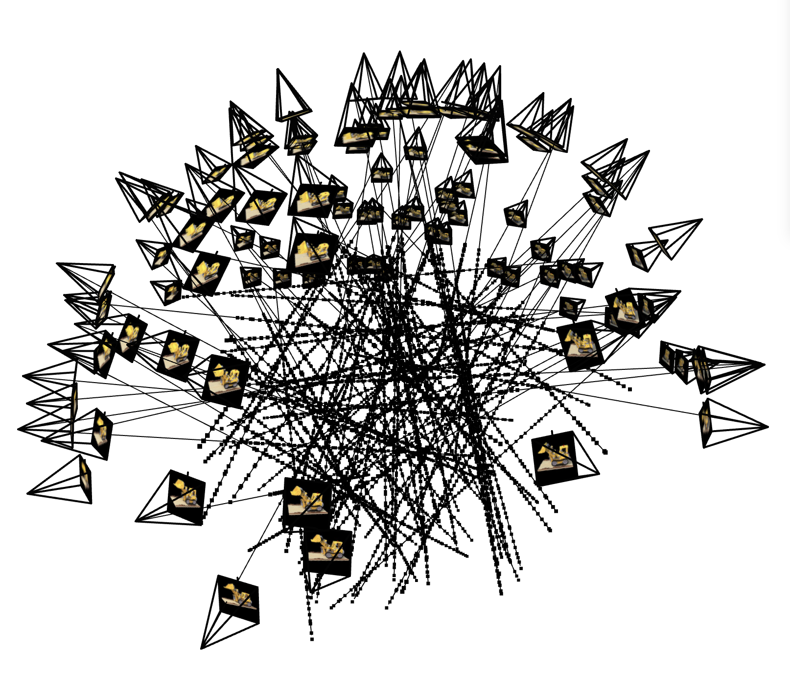
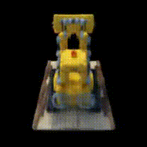
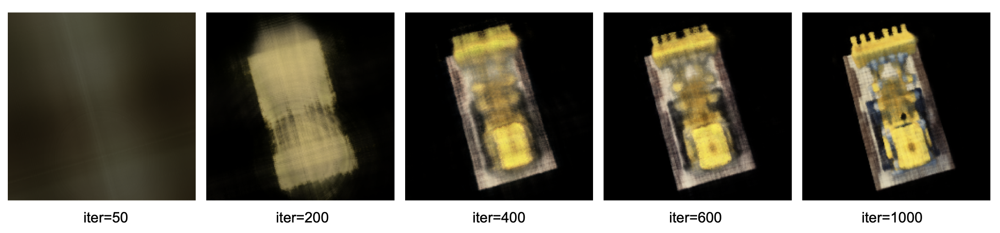
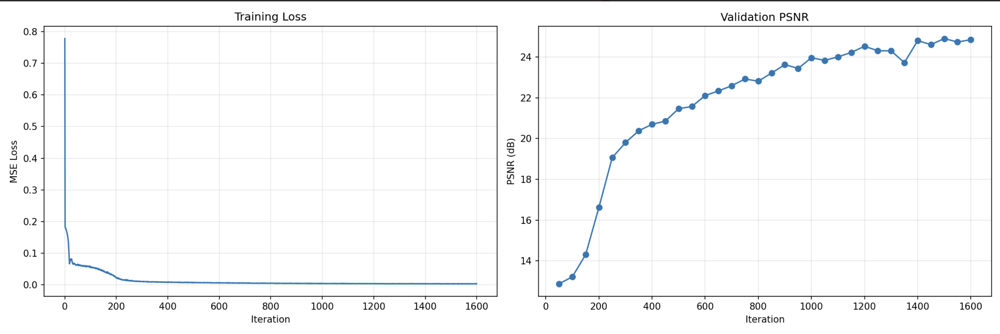
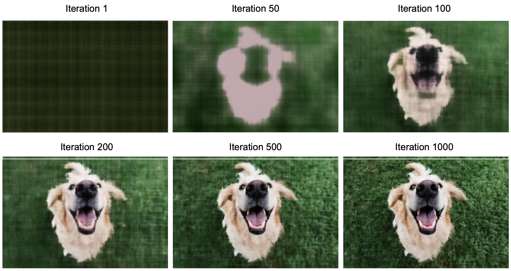
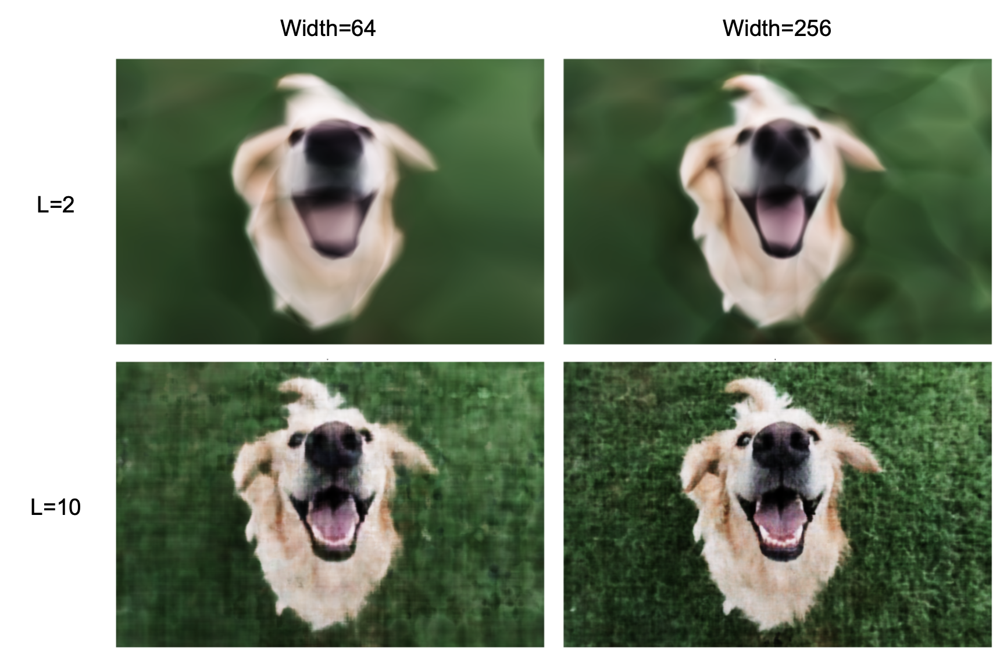

# Neural Radiance Fields from Scratch

This project implements from scratch an end-to-end NeRF pipeline (camera calibration → pose estimation → neural scene representation → novel view synthesis). 

**What is NeRF**:
NeRF represents a scene as a continuous function learned by a neural network. The function maps any 3D coordinate and viewing direction to a colour and density. Given a handful of 2D photos, NeRF synthesises photorealistic novel views from any angle — complete with accurate lighting and reflections — producing smooth fly-through videos as if a real 3D scene existed.

My deep dive article about NeRF:
https://khooanxian.medium.com/nerf-turning-photos-into-3d-6e5de0b6cb9e 



## Pipeline

```
Raw Images + ArUco Tags
    │
    ├── 1. Camera Calibration ──────→ Intrinsics (K) + Distortion Coefficients
    ├── 2. Pose Estimation ─────────→ Camera-to-World Matrices (c2w)
    ├── 3. Dataset Preparation ─────→ Undistorted images + train/val/test split
    ├── 4. NeRF Training ───────────→ MLP learns σ(x,y,z) and c(x,y,z,θ,φ)
    └── 5. Novel View Rendering ────→ Volume rendering from new camera poses
```
NeRF Training (step 4) in detail: 
1. Volumetric Ray Casting: For each pixel in the target view, a camera ray is cast through the 3D space. Multiple 3D points (x,y,z) are sampled along each ray. 
2. Neural Network Inference: For each sampled point, query the neural network to predict the RGB color and density at that point. 
3. Volume Rendering: The predicted colors and densities are integrated along the ray, collapsing the 3D data back into a single 2D pixel value
4. Optimisation: Minimise Mean Squared Error (MSE) between the rendered pixel color and the actual pixel color from the training images.

## Architecture

**NeRF MLP** (based on [Mildenhall et al., 2020](https://arxiv.org/abs/2003.08934)):

| Component | Details |
|---|---|
| **Positional encoding** | Sinusoidal PE — L=10 for (x,y,z), L=4 for viewing direction |
| **Coordinate branch** | 8 fully-connected layers (256-dim) with skip connection at layer 5 |
| **Density head** | Position-only → σ via ReLU (non-negative by construction) |
| **Colour head** | Position features + view direction → RGB via Sigmoid |
| **Volume rendering** | Stratified sampling, alpha compositing, white background |


## Results

### Novel View Synthesis

Trained on ~100 images. The model learns a continuous 3D scene representation and renders novel views at **25.2 dB PSNR**.



**Reconstruction quality across training iterations:**



**Training loss curve:**



---

### 2D Neural Field Fitting

As a simpler baseline, an MLP learns to map pixel coordinates (x, y) → RGB for a single image.



**Hyperparameter ablation** — positional encoding frequency L and network width jointly determine reconstruction quality. Low frequencies miss fine detail; narrow networks lack capacity:



---

## Quick Start Command Lines

```bash
# Install dependencies
pip install -r requirements.txt

# Train 2D neural field (fast demo, no GPU required)
python scripts/train_2d_field.py --image your_photo.png --num_iters 1000

# Run hyperparameter ablation
python scripts/train_2d_field.py --image your_photo.png --grid_search

# Train NeRF (requires pre-processed dataset)
python scripts/train_nerf.py --dataset data/lego_200x200.npz --near 2.0 --far 6.0

# Render novel views
python scripts/render_novel_views.py \
    --checkpoint results/nerf/model.pth \
    --dataset data/lego_200x200.npz \
    --output novel_views.mp4
```

### Creating Your Own Dataset

Capture images of a scene with a visible ArUco marker (4x4_50 dictionary), then:

```bash
# 1. Calibrate camera (one-time)
python -c "
from src.calibration import calibrate_camera
K, dist = calibrate_camera('calibration_images/', tag_size_m=0.06)
import numpy as np; np.savez('calibration.npz', camera_matrix=K, dist_coeffs=dist)
"

# 2. Estimate poses and prepare dataset
python -c "
from src.calibration import estimate_poses, prepare_dataset
import numpy as np
calib = np.load('calibration.npz')
poses = estimate_poses('scene_images/', calib['camera_matrix'], calib['dist_coeffs'])
prepare_dataset(poses, calib['camera_matrix'], calib['dist_coeffs'], output_file='my_dataset.npz')
"
```

## Project Structure

```
├── src/
│   ├── positional_encoding.py   # Sinusoidal PE (shared)
│   ├── image_mlp.py             # 2D neural field
│   ├── nerf_model.py            # NeRF MLP with skip connections
│   ├── rays.py                  # Pixel → ray conversion
│   ├── rendering.py             # Volume rendering + ray marching
│   ├── dataset.py               # Data loading + ray sampling
│   └── calibration.py           # ArUco calibration + pose estimation
├── scripts/
│   ├── train_nerf.py            # NeRF training
│   ├── train_2d_field.py        # 2D field training + ablation
│   └── render_novel_views.py    # Novel view video generation
└── requirements.txt
```

## References

- Mildenhall et al., [NeRF: Representing Scenes as Neural Radiance Fields for View Synthesis](https://arxiv.org/abs/2003.08934), ECCV 2020
- Tancik et al., [Fourier Features Let Networks Learn High Frequency Functions in Low Dimensional Domains](https://arxiv.org/abs/2006.10739), NeurIPS 2020
s
